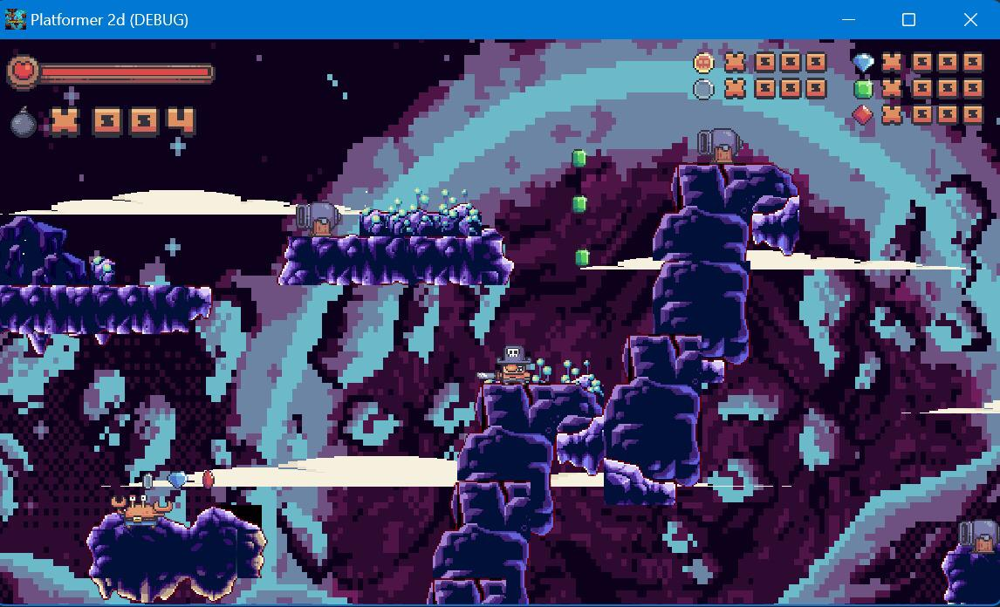
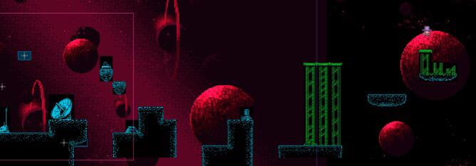
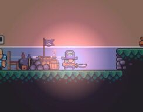
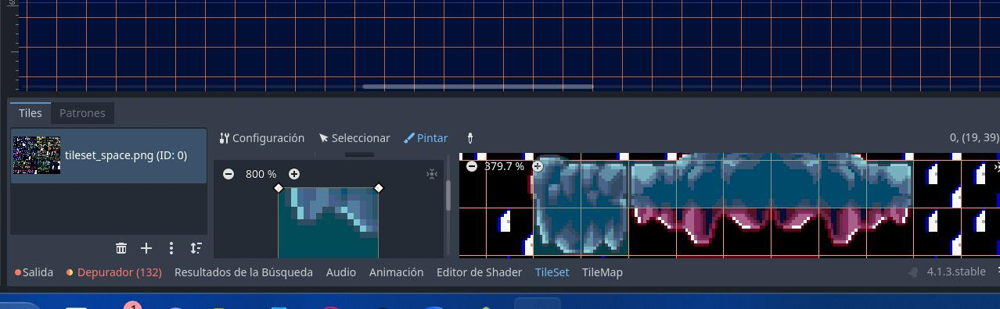
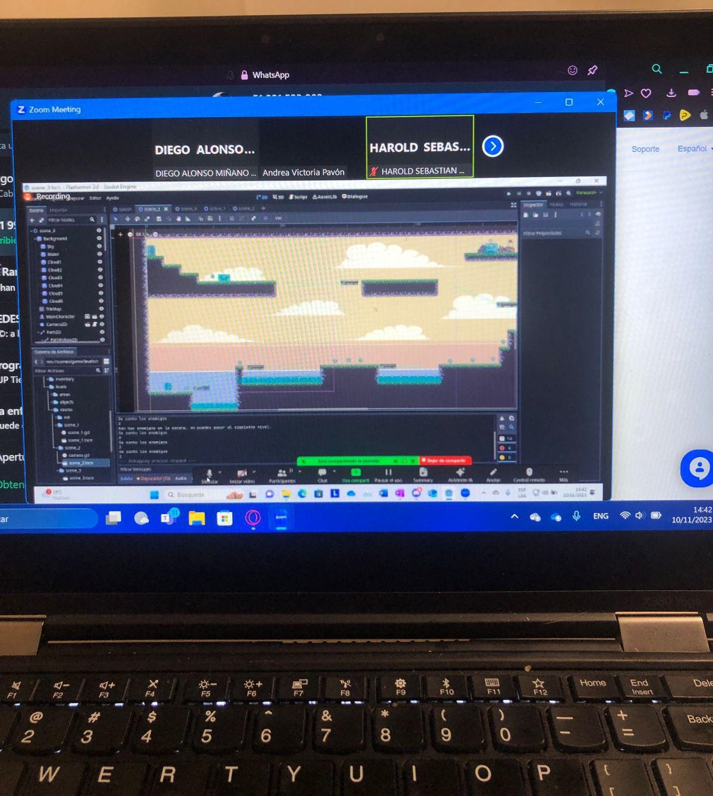

# Pirata Mala Plata

## Acerca de

**Pirata Mala Plata** es un juego de plataformas desarrollado por Endless studios, donde un pirata busca su tesoro. Para el programa Gamelab de Endless Studios y la UTP, **modifiqué** este juego como parte de una tarea. La tarea consistió en agregar 2 niveles nuevos y explorar nuevas mecánicas.

- **Personaje:** Pirata en busca del tesoro
- **Nueva Ambientación:** Entorno temático espacial
- **Nuevas Mecánicas:** Agregado de un dash para movimiento rápido tanto en tierra como en el aire

Aquí hay una vista previa de la nueva mecánica de dash:

### Diseños de Niveles

**Nivel 1:**

**Nivel 2:**

### Sistema de Partículas

**Sistema de Partículas de Iluminación:**

### Workflow

## Mi Experiencia

Los meses trabajando en este proyecto fueron intensos, alternando entre el programa Gamelab, las clases de la universidad y mi trabajo. Incluso trabajaba en el juego durante las horas de trabajo para cumplir con los plazos y asegurarme de que todo estuviera en marcha. Esta experiencia me permitió adentrarme en GDScript y enamorarme de Godot, mejorando mis habilidades en desarrollo y diseño de juegos. Fue un viaje gratificante, y estoy orgulloso de cómo evolucionó el juego con las nuevas características y niveles.

## Instalación

1. **Descargar el Proyecto:**
   - Clona o descarga el proyecto desde el [repositorio](https://github.com/Gatorrante/Godot_Endless_Program).

2. **Extraer el Archivo:**
   - Localiza el archivo ZIP descargado y descomprímelo.

3. **Abrir el Proyecto:**
   - Abre Godot 3.5.
   - Ve a `Proyecto` -> `Abrir Proyecto` y navega hasta la carpeta descomprimida.
   - Selecciona el archivo `project.godot` para abrir el proyecto en Godot.

4. **¡Disfruta!**
   - Una vez que el proyecto esté abierto, podrás explorar y jugar el juego modificado con los nuevos niveles temáticos espaciales y mecánicas.

  
Read in English

## About

**Pirata Mala Plata** is a platformer game where a pirate is on a quest to find his treasure. For the Gamelab program at Endless Studios and UTP, I **modified** this game as part of an assignment. The task was to add 2 new levels and explore new mechanics.

- **Character:** Pirate seeking treasure
- **New Atmosphere:** Space-themed environment
- **New Mechanics:** Added a dash mechanic for fast movement both on land and in the air

Here is a preview of the new dash mechanic:

### Level Designs

**Level 1:**

**Level 2:**

### Particle System

**Lighting Particle System:**

### Workflow

## My Experience

The months working on this project were intense, balancing between the Gamelab program, university classes, and my job. I even worked on the game during my job hours to meet deadlines and ensure everything was on track. This experience allowed me to delve into GDScript and fall in love with Godot, enhancing my skills in game development and design. It was a rewarding journey, and I am proud of how the game evolved with the new features and levels.

## Installation

1. **Download the Project:**
   - Clone or download the project from the [repository](https://github.com/Gatorrante/Godot_Endless_Program).

2. **Extract the File:**
   - Locate the downloaded ZIP file and extract it.

3. **Open the Project:**
   - Open Godot 3.5.
   - Go to `Project` -> `Open Project` and navigate to the extracted folder.
   - Select the `project.godot` file to open the project in Godot.

4. **Enjoy!**
   - Once the project is open, you can explore and play the modified game with the new space-themed levels and mechanics.

